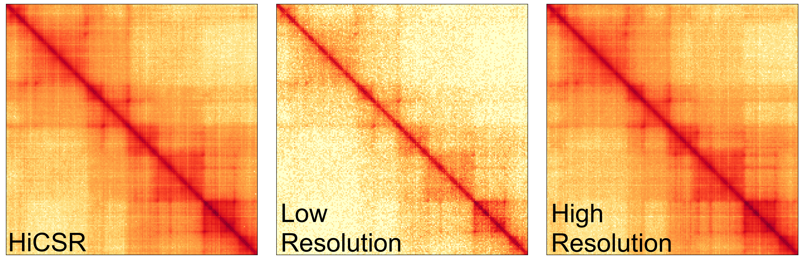

<!-- PROJECT LOGO -->
 
  

# HiCSR: a Hi-C super-resolution framework for producing highly realistic contact maps</h3>
Implementation of HiCSR framework described in this paper:

> Michael C Dimmick, Leo J Lee, and Brendan J Frey  
> HiCSR: a Hi-C super-resolution framework for producing highly realistic contact maps  
> bioRxiv preprint  
> [10.1101/2020.02.24.961714](https://www.biorxiv.org/content/10.1101/2020.02.24.961714v1)

<!-- ABOUT HiCSR -->
## About HiCSR

HiCSR is a Hi-C super-resolution framework written in python capable of producing enhanced contact maps which are both accurate and realistic. The HiCSR framework optimizes for a weighted combination of adversarial loss, pixel-wise L1 loss, and a feature reconstruction loss obtained from the latent representation of a task specific denoising autoencoder.

A sample of HiCSR-enhanced Hi-C data is shown below:

<!-- TABLE OF CONTENTS -->
## Table of Contents

* [Installation](#installation)
  * [Dependencies](#dependencies)
  * [Anaconda Python](#anaconda-python)
  * [Pip](#pip)
* [Usage](#usage)
  * [Preprocessing](#preprocessing)
  * [Training](#training)  
  * [Inference](#inference)
* [HiCSR Example](#hicsr-example)
  * [Creating HiCSR Dataset from Contact Maps](#creating-hicsr-dataset-from-contact-maps)
  * [Training HiCSR](#training-hicsr)  
  * [Enhancing Contact Maps](#enhancing-contact-maps)
* [License](#license)

## Installation

### Dependencies
HiCSR is developed with [Python 3](https://www.python.org) and [PyTorch](https://pytorch.org) (1.1.0 +). We provide a tested Conda environment.

### Anaconda Python
We recommend using HiCSR with the conda package manager from 
[Anaconda](https://www.anaconda.com/distribution/).

To create a Conda environment for running HiCSR, use the
`environment.yaml` file, which will install all required dependencies:

    conda env create -f environment.yaml

Activate your environment with

    conda activate HiCSR
    
### Pip
Alternatively you can install the dependencies via the `requirements.txt` file
for pip:

    pip install -f requirements.txt

## Usage

### Preprocessing

The preprocessing script is located here: [`preprocessing.py`](./preprocessing.py). This script takes raw n x n Hi-C contact matrices as input and generates HiCSR training samples as described in the paper. The resultant dataset can be directly used for training. 
Call the script with the `--help` flag to receive parameter usage:

    $ python preprocessing.py --help
    usage: preprocessing.py [-h] --input_fp INPUT_FP --output_fp OUTPUT_FP
                            [--normalize NORMALIZE] [--max_dist MAX_DIST]
                            [--input_size INPUT_SIZE] [--output_size OUTPUT_SIZE]

    optional arguments:
    -h, --help            show this help message and exit
    --input INPUT         root directory where both high resolution (hr) and low
                          resolution (lr) intrachromosomal Hi-C interaction
                          matrices are stored
    --output OUTPUT       output directory to write preprocessing results to
    --normalize NORMALIZE
                          option to normalize input before splitting data, for
                          information about the normalization method see the
                          paper, if set, normalized low and high resolution
                          contact maps will be stored also default = 1
    --max_dist MAX_DIST   maximum genomic distance to create submatrices, splits
                          with a loci greater than this value are not created.
                          Value is a number of pixels and is dependant on the
                          resolution of the dataset to be processed, default =
                          200 pixels
    --input_size INPUT_SIZE
                          submatrix split size for low resolution input, default
                          = 40
    --output_size OUTPUT_SIZE
                          submatrix split size for high resolution label,
                          default = 28

### Training
The preprocessing script is located here: [`train.py`](./train.py).
Call the script with the `--help` flag to receive parameter usage:

    $ python train.py --help
    usage: train.py [-h] --data_fp DATA_FP --model MODEL [--gpu GPU] --experiment
                    EXPERIMENT

    optional arguments:
    -h, --help            show this help message and exit
    --data_fp DATA_FP     directory containing training and validation data to
                          use for model training
    --model MODEL         Set the model to be trained, There are two options:
                          'HiCSR' will train the Hi-C enhancement model and
                          'DAE' will train the Denoising Autoencoder on the high
                          resolution data
    --gpu GPU             GPU number to use for training, if the system has no
                          GPU, training will automatically default to using the
                          CPU. default = 0.
    --experiment EXPERIMENT
                          experiment name associated with the training run, all
                          model logging and final model file are saved under
                          this name. Experiment name must match an entry in the
                          experiment_hyperparameters.json config file

The filepath required by `--data_fp` uses the following directory structure:

    ├── train
        ├── train-samples-1.npz
        ├── ...
        └── train-samples-n.npz
    └── valid
        ├── valid_samples-1.npz
        ├── ...
        └── valid_samples-m.npz

HiCSR training requires an experiment name which matches an entry in the configuration file for model training which specifies the model parameters. These configurations are stored
here: [`experiment_hyperparameters.json`](./experiment_hyperparameters.json).
                            
### Inference
The preprocessing script is located here: [`predict.py`](./predict.py).
Call the script with the `--help` flag to receive parameter usage:

    $ python predict.py --help
    usage: predict.py [-h] --input_fp INPUT_FP --output_fp OUTPUT_FP --model_type
                      MODEL_TYPE --model_fp MODEL_FP

    optional arguments:
    -h, --help            show this help message and exit
    --input INPUT         input directory where the low resolution Hi-C matrices
                          to be enhanced are stored
    --output OUTPUT       output directory to store resultant Hi-C matrices are
                          stored
    --model_type MODEL_TYPE
                          model type to predict with, HiCSR or DAE (Denoising
                          Autoencoder). HiCSR is used for Hi-C enhancement, DAE
                          is the loss network used to train HiCSR
    --model_fp MODEL_FP   pytorch model filepath to load for enhancement
                          predictions
                          
Inference with HiCSR expects normalized Hi-C contact maps.

## Example

We provide a small sample set of Hi-C matrix data to demonstrate how to use the HiCSR package. These sample matrices are stored in the [input_samples](./input_samples) directory, where each sample has the following naming convention `<chromosome>-<cell_type>-<downsample_factor>-<file_tag>.txt.gz`:

    input_samples/
    ├── hr
    │   ├── chr21-GM12878-1-sample.txt.gz
    │   └── chr22-GM12878-1-sample.txt.gz
    └── lr
        ├── chr21-GM12878-16-sample.txt.gz
        └── chr22-GM12878-16-sample.txt.gz
        
### 1. Creating HiCSR Dataset from Hi\-C Contact Maps

To preprocess the samples, call the preprocessing script on the root directory `input_samples` with the desired flags. In this example we use the default split settings and normalize the inputs, saving the output to the `preprocessing_output` directory:

    $ python preprocessing.py --input input_samples/ --output preprocessing_output/ --normalize 1
    
This will generate the normalized HiCSR submatrix dataset samples, their respective matrix indices, and the normalized data:

    preprocessing_output/
    ├── HiCSR_dataset
    │   ├── indices
    │   │   ├── chr21-GM12878-HiCSR-dataset-normalized-idxs.npz
    │   │   └── chr22-GM12878-HiCSR-dataset-normalized-idxs.npz
    │   └── samples
    │       ├── chr21-GM12878-HiCSR-dataset-normalized-samples.npz
    │       └── chr22-GM12878-HiCSR-dataset-normalized-samples.npz
    └── normalized
        ├── hr
        │   ├── chr21-GM12878-1-norm.txt.gz
        │   └── chr22-GM12878-1-norm.txt.gz
        └── lr
            ├── chr21-GM12878-16-norm.txt.gz
            └── chr22-GM12878-16-norm.txt.gz

### 2. Training HiCSR (Optional)

To train HiCSR, the script `train.py` is used.  For this example, one of the sample matrices are put into the training folder and the other is put into the validation folder. The script expects the following directory structure:

    ├── train
        └── chr21-GM12878-HiCSR-dataset-normalized-samples.npz
    └── valid
        └── chr22-GM12878-HiCSR-dataset-normalized-samples.npz
        
Once the correct directory structure has been made the script can be called as follows:

    $ python train.py --data_fp preprocessing_output/HiCSR_dataset/samples/ --model HiCSR --experiment test_HiCSR
    
This will begin the training procedure. Training progress is logged in the experiments directory:

    experiments/
    └── test_HiCSR
        ├── checkpoints
        │   └── HiCSRModel_ckpt_0.pth
        ├── HiCSRModel.pkl
        ├── logs
        │   └── test_HiCSR.log
        ├── tensorboard
        │   ├── ... (tensorboard files)
        └── test_HiCSR.pth
        
Each experiment generates training checkpoints, a pickled class model, training logs, tensorboard files for training monitoring, and a final pytorch model.

### 3. Enhancing Hi\-C Contact Maps

Hi-C contact maps can be enhanced using either a newly trained model from step 2, or using the [pretrained model](./pretrained_models) files. In either case, the prediction script expects normalized data generated from step 1:

    $ python predict.py --input preprocessing_output/normalized/lr/ --output HiCSR_predictions/ --model_type HiCSR --model_fp pretrained_models/HiCSR.pth
    
If the enhancement is successful, you should find one output file for each corresponding input file. These predicted matrices are normalized to the range \[-1,1\]. 

## License
This project is licensed under the [MIT License](./LICENSE)
